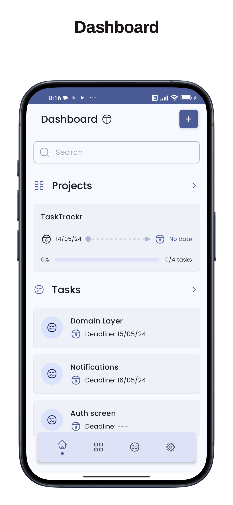
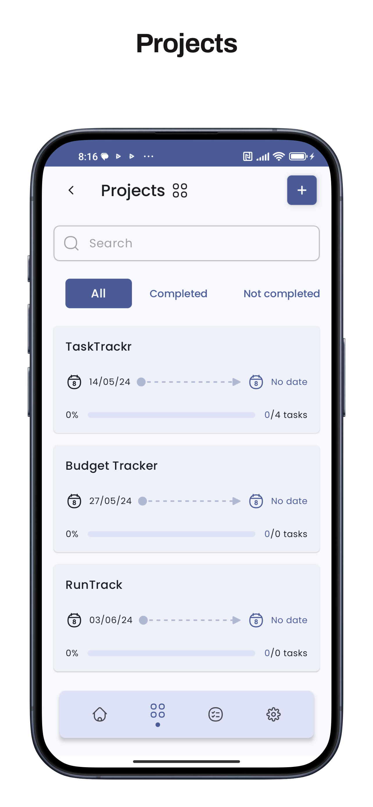
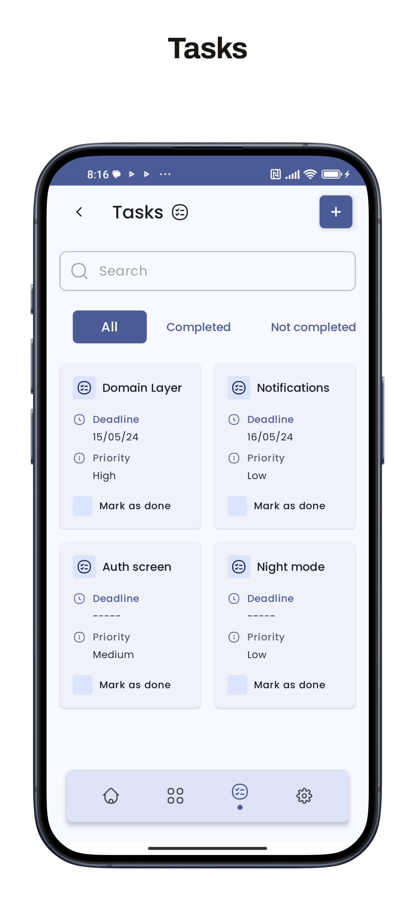
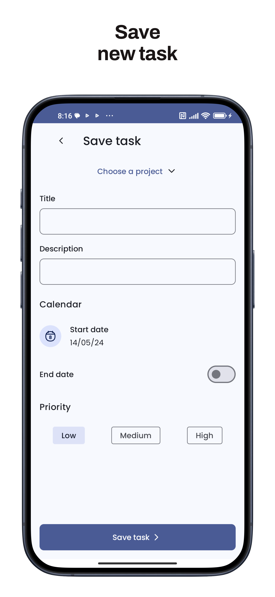
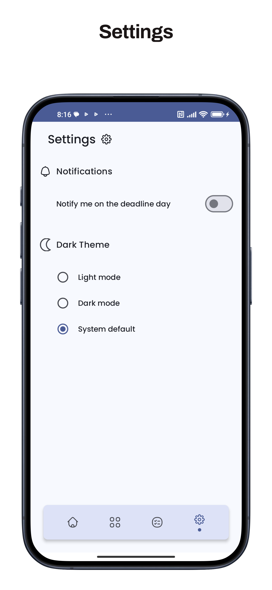

# TaskTrackr

**Manage your projects and tasks easily.**

TaskTrackr is your go-to companion for effortlessly managing your projects and tasks, whether you're a professional, student, or hobbyist. With intuitive features and a sleek interface, TaskTrackr helps you stay organized, focused, and productive.

 

## Screenshots

    
    
    

 

    
    

 

## Project architecture

The architecture of the project is based on domain driven design, the domain layer is the most inner circle following clean architecture guide line, leaving open the possibilities for expansion and development of the same

 

## Tech Stack

**Architecture:** Domain Driven Design, MVI

**Dependency injection:** Dagger Hilt

**Database:** Android Room

**UI:** Jetpack Compose, Material 3

 

## Attributions

Design inspired by [Tasker by Natsomy Shojo](https://www.figma.com/community/file/1246174485167354583/tasker-task-management-apps-ui-kits-community-copy)

 

## Was it useful?

 

